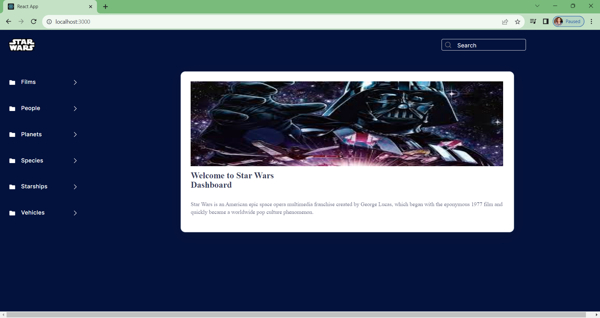
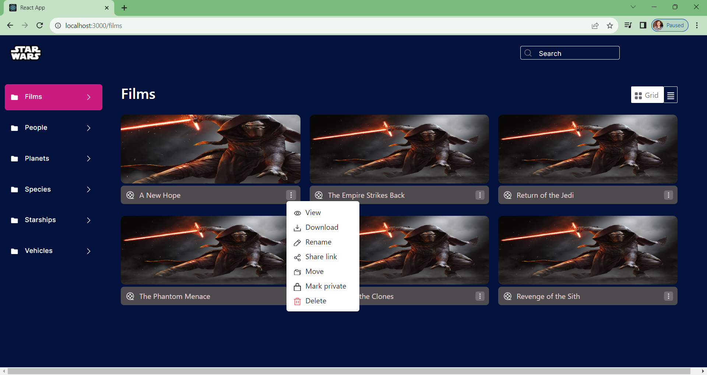
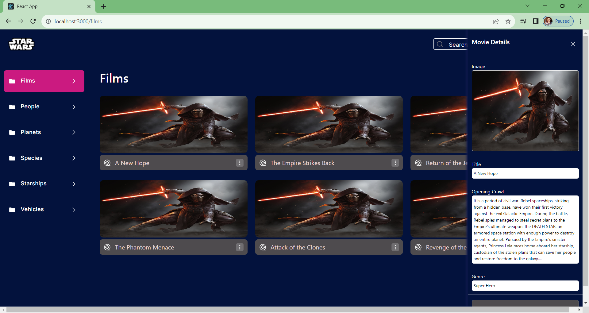
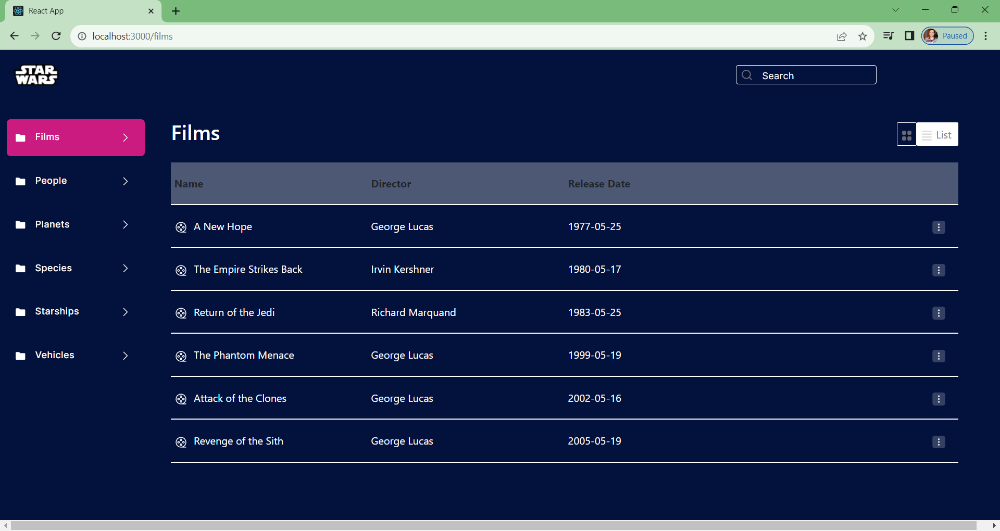
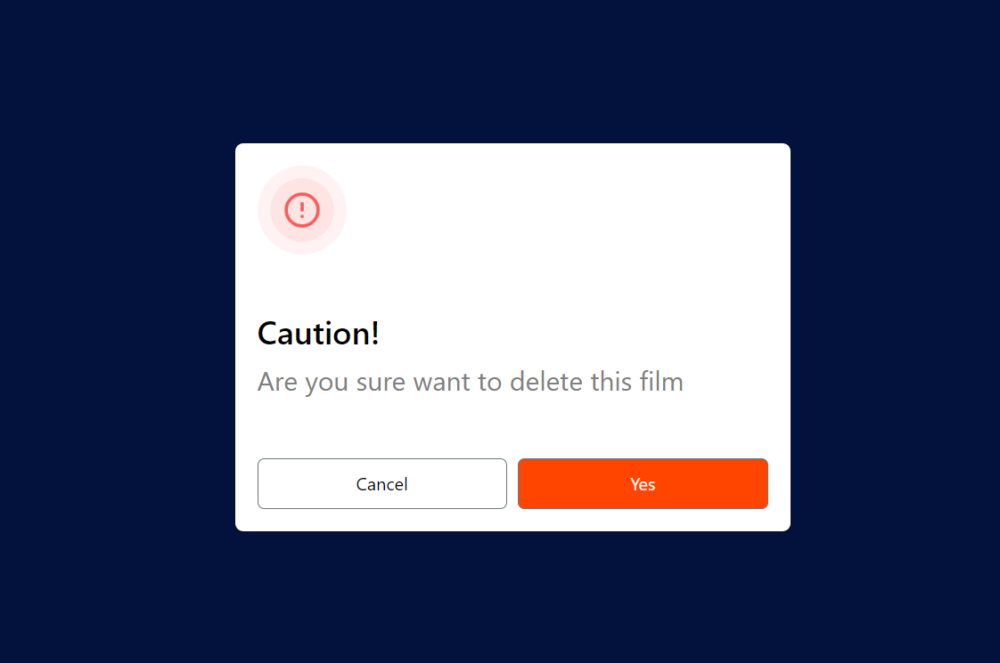

# Design Decision:  

1- Component-Based: The website is built by breaking it into smaller sections called components, like people, vehicles, species, etc. This helps in reusing code and keeping things organized.

2- Adaptive Design: The site is designed to work well on all devices—phones, tablets, computers—using Material-UI.

3- Styling Choices: Styling uses Bootstrap for the cards and CSS modules for other elements, including media queries for responsive design. 

4- Efficient Data Handling: Each section gets its data using a smart technique called the useEffect hook. This means data is fetched only when needed, reducing unnecessary calls to the server and making things run faster.

5- Organized Data Components: Every category has its own special component that deals with getting and showing its data. This makes the code neat and easy to manage because each section does its own thing.

# Getting Started
To get started with this project, follow these steps:

* Clone the project to your local machine.
* Open the project in your preferred IDE or text editor.
* Run npm install or i to install the required dependencies.

<table style="border: 1px solid black;">
            <tr>
                <td  style="border: 1px solid black ;">
                    
                </td>
                <td  style="border: 1px solid black ;">
                    
                </td>
            </tr>
            <tr>
                <td  style="border: 1px solid black ;">
                    
                </td>   
                <td  style="border: 1px solid black ;">
                    
                </td>
            </tr>
            <tr>
                     <td  style="border: 1px solid black ;">
                    
                </td>   
            </tr>
        </table>
